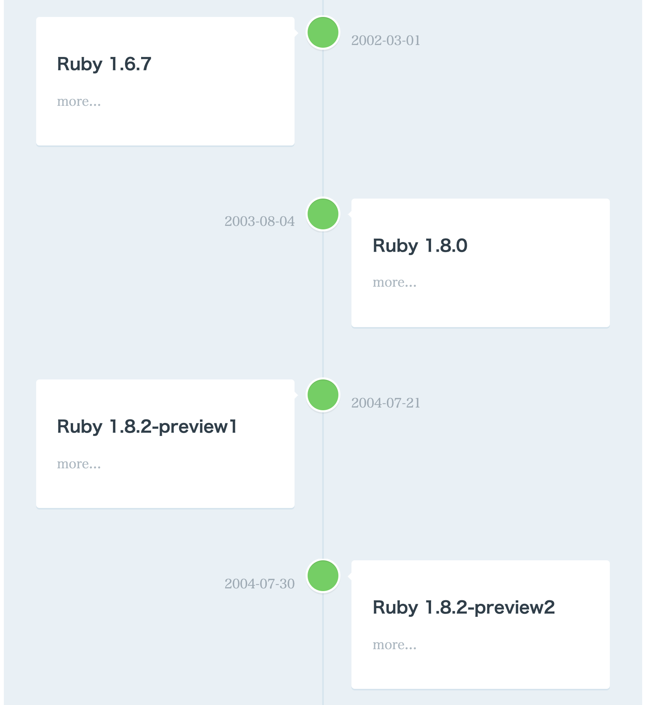

# ruby-releases-history [](https://app.netlify.com/sites/ruby-releases-history/deploys)

Ruby Releases History generated using [mdline](https://github.com/azu/mdline) 🗓

## Demo

- [https://ruby-releases-history.netlify.com](https://ruby-releases-history.netlify.com/)



## Manual Build

```sh
$ mkdir public
$ mdline ruby-releases.md -o public/index.html
```
